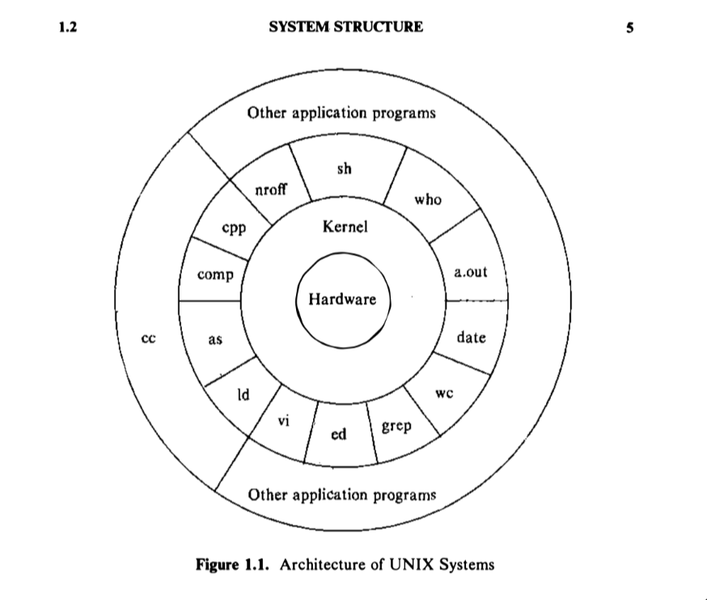
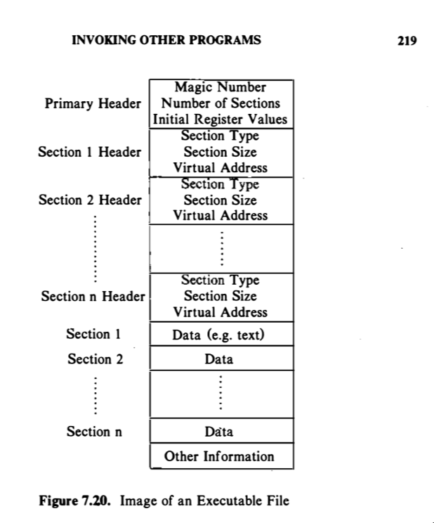

# Debugging: Um mergulho

## Ptrace

Antes de falarmos diretamente sobre o que é o Ptrace, é necessário entendermos o básico de como funciona o Sistema Operacional, então iremos falar brevemente sobre os ***Processos.***



##### Processos

Nos sistemas operacionais temos os programas rodando, aplicações do sistema e aplicações de usuários (como podemos ver na imagem acima), os processos são basicamente uma abstração desses programas executáveis, são instâncias dos executáveis no sistema, não existe um limite de quantos processos podem existir dentro do sistema, além de que os processos podem ter múltiplas instâncias dele mesmo através de chamadas de sistema (famosas ***[System Calls](https://www.geeksforgeeks.org/operating-systems/introduction-of-system-call/)***), realizando `fork`  e então `execl` com os argumentos necessários para a cópia, e se comunicar através de ***[Inteprocess Comunnication](https://www.geeksforgeeks.org/operating-systems/inter-process-communication-ipc/)******.***



Agora sabemos o que são os processos, ao menos de uma maneira um poucou mais intuitiva, vamos tocar em um ponto de como é possível um programa controlar a memória virtual, variáveis, callstack, etc. Nesse ponto que entra a system call `ptrace`, ela serve justamente para controlar o programa filho que está sendo executado pelo debugger, o debugger seta um bit na `tabela de entrada` informando que o programa está sendo 'rastreado'.

a chamada de ptrace -> ptrace (cmd, pid, addr, data) ;

```c
/* 
@param: cmd -> specifies various commands such as reading data, writing data, resuming
execution and so on
@param: pid -> process id of child
@param: addr -> memory address to be read or written
@param: data -> integer value used to be written on memory 
*/
ptrace (cmd, pid, addr, data);
```

&#x20;Essa chamada é colocada em um loop, recebendo eventos para escrita e leitura, resumir e executar o programa filho e "pronto", existe um debugger.

## GNU Debugger - GDB

#### Curiosidade

> "There was absolutely no reason that the new printer couldn't print and staple the old paper, but the firmware developers simply wouldn't let us do it. Instead, we have had to adapt ourselves to the printer software. In a just and fair society, software could be adapted to people's needs, and people wouldn't have to adapt instead to the software. This is why free software is necessary."
>
> fonte: https://www.fsf.org/blogs/community/201cthe-printer-story201d-redux-a-testimonial-about-the-injustice-of-proprietary-firmware

O projeto do GNU foi fortemente inspirado por uma dor real em que as pessoas se viram tendo que se adaptar ao funcionamento de um software, nesse caso um firmware de uma impressora que era capaz de mecanicamente realizar a tarefa desejada, porém, por razões de software, nunca foi pensado o caso de uso. Nisso veio a filosofia de que os códigos deveriam ser livres e plausíveis de serem adaptados as necessidades reais do usuário.


Linux foi criado por motivos pessoais do Linus de criar um sistema operacional para o seu próprio computador e mais poderoso do que o MINIX. Naquela época os sistemas operacionais eram bastante limitados e também restritivos.

Rust foi criado porque Graydon Hoare, tinha problemas de estrutura no prédio em que ele morava, o elevador tinha mal funcionamento, e ele suspeitava de que isso era referente aos problemas de vazamento de memória que ocorrem em C e C++ (que são as principais linguagens usadas em embarcados).

#### Estrutura

O GDB internamente consiste de 3 grandes subsistemas

* UI :=> Lida com a interação provendo interfaces
* Symbol Handling (Symbol Side) :=> Lida com arquivos, informações de debugging, tabela de símbolos, parsing das expressões da linguagem, tipagem e impressão de valores.
* Target System Handling :=> Controla execução, análise de pilha de chamadas e manipulação do alvo físico.


#### Suporte a quais linguagens

* &#x20;Ada
* &#x20;Assembly
* &#x20;C
* &#x20;C++
* &#x20;D
* &#x20;Fortran
* &#x20;Go
* &#x20;Objective-C
* &#x20;OpenCL
* &#x20;Modula-2
* &#x20;Pascal
* &#x20;Rust


### Debugando na prática

* **run, r** → executa o programa
* **break, b** (linha, função, endereço de ins) → insere um breakpoint em determinada linha, função ou endereço de instrução.
* **watch, w** → Adiciona um breakpoint de dado, e fica “assistindo” a expressão ou variável até ocorrer uma alteração, te mostrando a alteração.
* **break conditions e watch conditions&#x20;**→ É possível adicionar uma condição para a parada do código, fazendo que a execução do código pare somente se chegar naquele erro esperado ou valor esperado. O mesmo vale para o watch condition, a variável ou expressão só será observada, se a condição acontecer.
* clear x delete → O clear serve para apagar um breakpoint no determinado frame stack em que está sendo executado no momento. O delete, é possível passar o ID do breakpoint e apagá-lo.
* continue, c → Essa função é uma das mais importantes, rodando essa instrução o debugger irá continuar a execução do código até chegar no próximo breakpoint, caso não exista mais nenhum, irá rodar o programa todo ou até gerar a falha.
* step, s → Com essa função é possível adentrar na função que está sendo chamada naquele momento e vasculhar a execução dela ponto por ponto.
* next, n → Você passa para a próxima linha de execução ou instrução de execução, assim você pode ir avaliando e navegando o código debugado.
* info → sobre o programa sendo debugado. É um comando genérico, com ele você consegue ter informações a respeito do breakpoints, watchpoints e outros pontos do programa em execução.
* show → sobre o debugger, mostra informações sobre as configurações específicas do debugger, ao exemplo se você passar a flag que ativa o debugger interativo, vai te mostrar se está ligado ou não.
* checkpoint e restart → É possível passar o comando `checkpoint` sem nenhum argumento e ele iniciará um novo processo filho com todas as informações do processo que está sendo debugado. Caso você pule o ponto do código interessado, pode executar o `restart` com o ID do checkpoint e então, voltará para aquele momento, com todas as informações (variáveis, endereços, call stack, etc).
* print → É um dos comandos mais importantes, com ele você consegue inspecionar os valores das variaveis. 
* call → É possível chamar uma função do seu código de maneira interativa.
* set → Esse serve tanto para configurar o debugger para alterar alguma propriedade, ou setar suas variáveis de usuário, comandos personalizado e por aí vai.
* backtrace → Com o backtrace é possível ver as chamadas de funções que ocorreram até o momento. 
* &#x20;frame → Possível ver as informações e valores existentetes que tem nesse ponto da filha. Podendo também selecionar uma parte da pilha específica para ser analisado.
* display → É possível realizar um display automático de expressões que você iria ficar rodando a todo momento, assim, você não vai ficar precisando dar print e passando uma expressão extremamente complexa.


### Referências

\[1] https://sourceware.org/gdb/current/onlinedocs/gdb.pdf

\[2]https://www.sourceware.org/gdb/5/onlinedocs/gdbint.pdf

\[3] BACH, Maurice J. The Design of the UNIX Operating System. Englewood Cliffs, NJ: Prentice-Hall, 1986.

\[4] Tanenbaum, Andrew S., and Albert S. Woodhull. Operating Systems: Design and Implementation. 3rd ed., Prentice Hall, 2006.


###
